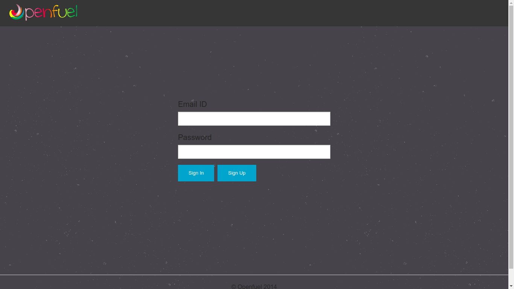
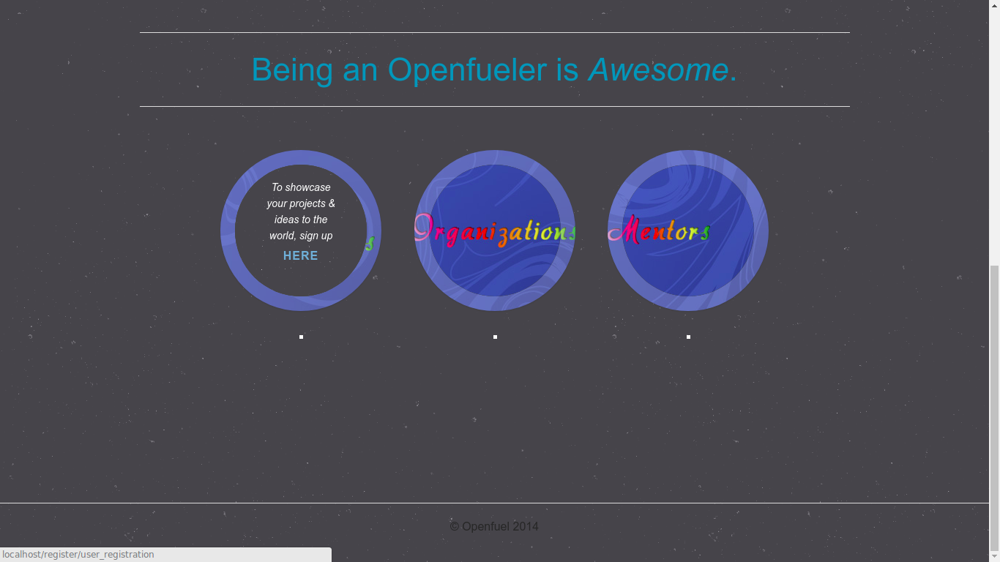
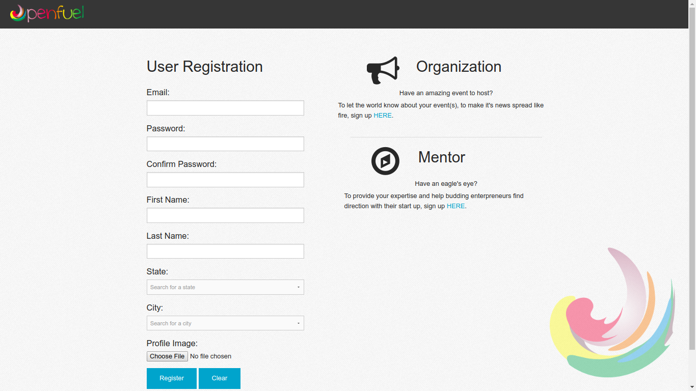
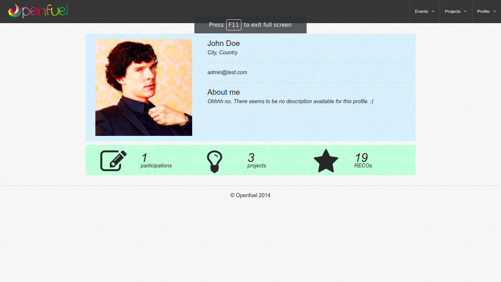
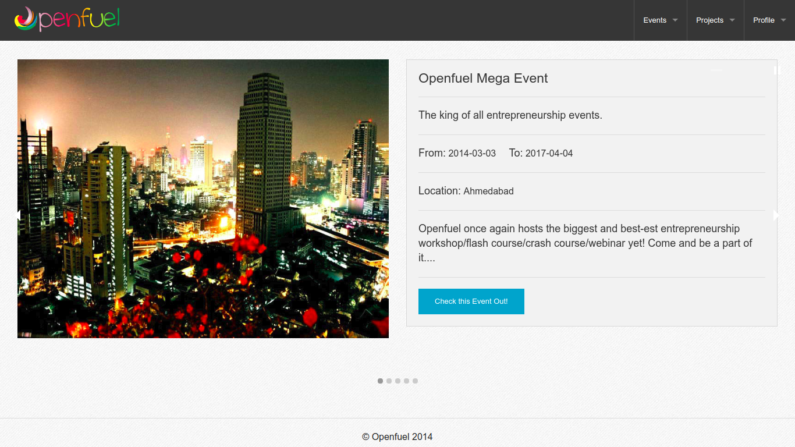
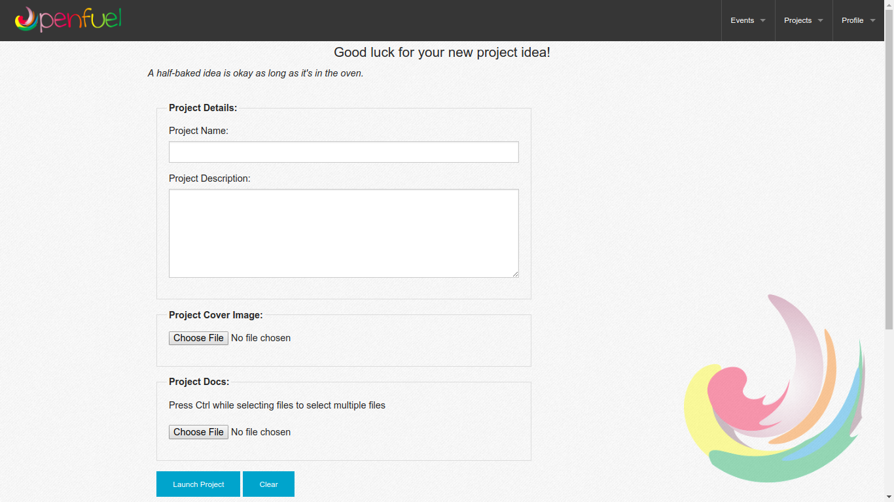
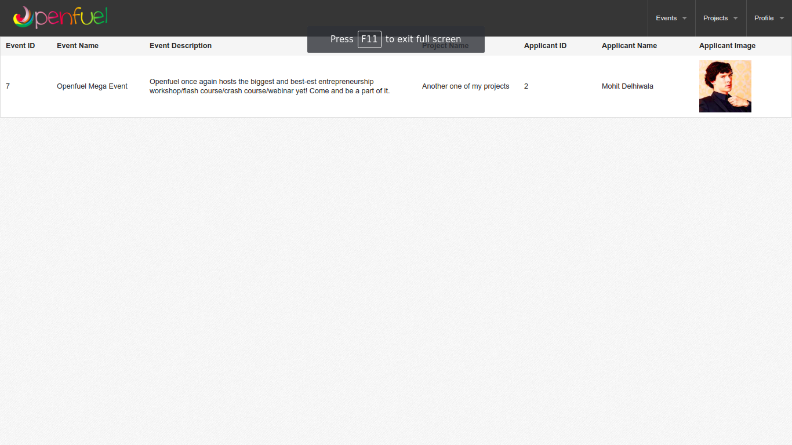

# Openfuel

A business plan creation and mentorship platform that helps bridge the gap between industy mentors and budding entrepreneurs. The project is based on the PHP MVC framework CodeIgniter with a MySQL database as the data store.

# Screenshots

## Login

## Sign Up Options

## User Registration

## User Profile

## Event

## Project Creation

## Events Overview

